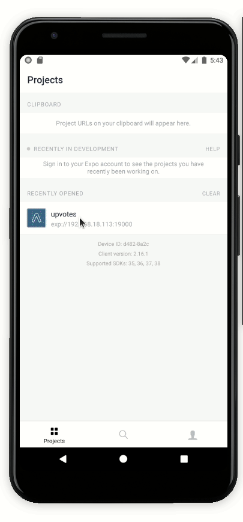
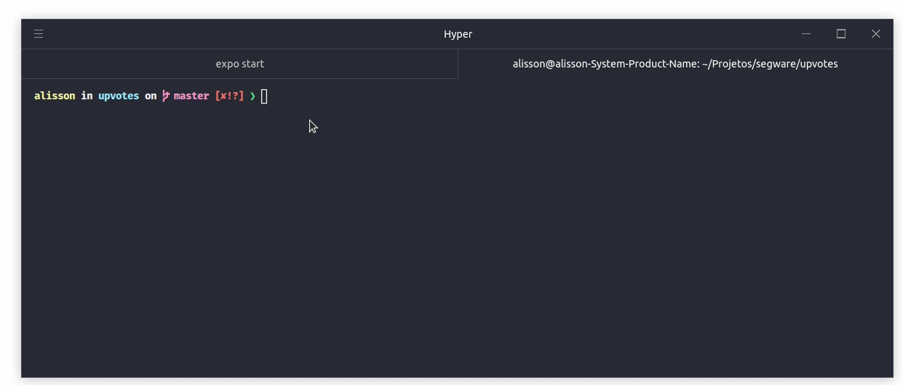

<h1 align="center">UpVotes</h1>
- This app was developed to challenge Segware.

## 💻  A app of upvotes.

  - A simple app of messages and votes;
  - A home linsting list messages;
  - It is possible to vote on messages so that they gain prominence;

<p align="center">


</p>

## 💻  Note.

  - it is necessary to inform that the application was developed in 
  a very simple way, so it would still be possible to implement some 
  concepts such as context api, redux, error handling, session 
  expiration and even a better UI / UX design.


## 🎩 How it works

 - Access the application folder
```sh
cd upvotes
```
 - Install dependêncies
```sh
run yarn || npm install
```
 - Run the project
```sh
expo start
```

## 🎩 For run test.

 - This command will run unit and integration tests
```sh
yarn test
```

GoodLook.
